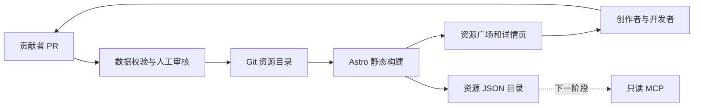

# OpenCraft 技术规划

## 目标

构建免费、可 Fork、自托管的 AI 建站资源社区。用户无需登录即可预览、搜索、复制提示词和下载源码；贡献者通过 GitHub PR 增加或改进内容。优先清晰的许可、真实效果、可验证内容与低维护成本。

## 数据流

## 工具与用途

| 工具 | 当前用途 | 取舍 |
|---|---|---|
| Node.js 22.12+ / npm | 开发、构建、锁定依赖 | 贡献者使用统一 lockfile |
| Astro / TypeScript | 静态页面和少量交互 | 内容站无需常驻应用服务 |
| JSON / Zod | 资源目录和结构校验 | PR 比后台上传摩擦大，但可审核可追溯 |
| 原生 CSS | 视觉布局、微交互 | 首版不引入大型动效库 |
| Node test runner | 数据约束与失败路径测试 | 不为纯装饰写镜像测试 |
| Playwright | 搜索、筛选、预览、移动布局 | CI Chromium；其他浏览器待扩展 |
| GitHub Issues / PR / Actions | 协作和检查 | 维护者仍需人工审查许可和行为 |
| GitHub Pages | 可选静态托管 | 有平台额度与使用条件，不保证无限容量 |

无需数据库、登录供应商、对象存储、收费设计服务和 LLM API Key。已有 AI 编辑器可辅助开发，网站运行不依赖模型服务。

## 资源协议 v1

一资源一 JSON：slug、title、description、category、tags、author、license、source、prompt。slug 与文件名一致；source 限定 public/examples 内的 HTML；资源不执行构建代码。数据限制来自 `scripts/catalog.mjs`，构建前强制验证。

`api/resources.json` 为版本化静态读取入口。它没有实时搜索服务；客户端先下载小目录本地搜索。随着目录增长可按标签拆分索引或引入预构建全文搜索，再以实际规模决定数据库。

## 许可策略

平台 MIT，项目原创示例 MIT。社区内容保留自身明确许可证；扩展许可集前评估再分发方式与归属。免费取用的运营承诺不添加限制商业用途的条款。不要将可公开查看误认为可再分发。

## 质量与失效处理

- 元数据错误、源文件缺失或不支持的内容：CI 失败，不发布。
- 未匹配搜索：显示空状态及重置入口。
- 剪贴板拒绝：告知用户手动复制，不伪报成功。
- Pages 发布失败：上个成功版本继续可用，查看 Actions 诊断。
- 恶意 PR：只读无密钥 CI、人工审核；后续脚本预览需独立 origin。
- 不支持 JavaScript 的访问者：资源和详情保持静态可读，客户端搜索不可用。

## 完成与后续边界

v0.1 实现资源闭环的本地可运行基础。平台级评分、用户账户、评论、收藏、在线投稿、MCP 服务和远程动态预览不在此版本。所有重要选型见 [ADR](adr/0001-static-git-catalog.md)。

## 官方依据

- [Astro 静态端点](https://docs.astro.build/en/guides/endpoints/)
- [Astro GitHub Pages 部署](https://docs.astro.build/zh-cn/guides/deploy/github/)
- [GitHub PR 工作流安全](https://docs.github.com/en/actions/reference/security/securely-using-pull_request_target)
